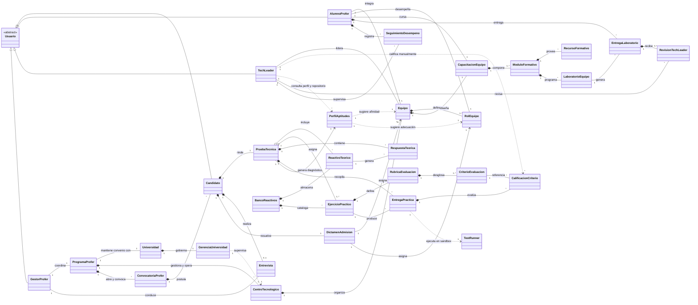

[Al inicio](/README.md) / **Modelo del dominio** / [Actores y casos de uso](/RUP/01-requisitos/01-actores-casos-uso/README.md) / [Detalle de casos de uso](/RUP/01-requisitos/03-detalle-casos-uso/README.md) / [Análisis](/RUP/02-analisis/README.md) / [Diseño](/RUP/03-diseño/README.md) / [Desarrollo](/RUP/04-desarrollo/README.md)

# Modelo del Dominio

El modelo del dominio formaliza el vocabulario, las entidades conceptuales, las relaciones estructurales y las invariantes de negocio de la plataforma **CTS Academy & Evaluator**.

---

## 🏛️ Contexto Institucional y Gobernanza

El marco operativo y de gobernanza del sistema se fundamenta en un convenio de colaboración institucional:

1. **Convenio Universidad – Programa PROFER**:
   * El **`ProgramaProfer`** es un programa formativo y de desarrollo que mantiene un **convenio formal con la Universidad (UNEATLANTICO)** para otorgar reducciones porcentuales en la matrícula y colegiatura a los alumnos del Grado en Ingeniería Informática que superen el proceso de selección.
   * La **Universidad**, a través de su **`GerenciaUniversidad`**, supervisa la vigencia del convenio y el cumplimiento de los acuerdos.
   * El **`CentroTecnologico` (CTS)** **no es gestionado directamente por la Universidad**: lo gestiona y opera de forma autónoma el **`ProgramaProfer`** bajo la supervisión de la Gerencia de la Universidad.
   * Por consiguiente, la Universidad no abre directamente las convocatorias de becas: es el **`ProgramaProfer`** el que planifica, abre y gestiona las **`ConvocatoriaProfer`** en el marco del convenio.

2. **Embudo de Admisión y Selección (Filtro en 2 Fases)**:
   * **Fase 1 (Test de Aptitudes Técnicas - Núcleo de la plataforma)**: Es el primer filtro eliminatorio. Evalúa de forma estandarizada los conocimientos previos de los candidatos mediante reactivos teóricos y desafíos prácticos de código (maquetación CSS Grid/Flexbox, Vanilla JS, asincronía, Git). La plataforma genera un **Perfil de Aptitudes** que diagnostica las destrezas concretas del aspirante (Frontend, Backend, Algoritmia, Diseño).
   * **Fase 2 (Entrevista Personal y de Encaje)**: Los candidatos que superan el umbral del test son convocados a una entrevista conducida exclusivamente por el **Gestor PROFER**. El Tech Leader no participa en las entrevistas; su labor de selección se enfoca en calificar los desafíos prácticos del test técnico y consultar el perfil de aptitudes, CV y repositorios de los aspirantes.
   * **Asignación Estratégica**: Con base en los resultados del test y la entrevista, el candidato apto es formalizado como **Alumno PROFER** y asignado a uno de los **6 Equipos** de desarrollo del centro tecnológico, definiendo además su **Rol específico** en dicho equipo (ej. Desarrollador Frontend, Backend, QA/DevOps).

3. **Capacitación Interna por Equipo (CTS Academy)**:
   * Los 6 equipos tienen áreas de responsabilidad y stacks tecnológicos distintos dentro del centro y la universidad.
   * Cada equipo cuenta con un plan de **Capacitación propio** adaptado a sus necesidades y al rol del alumno.
   * El Alumno PROFER cursa módulos formativos y resuelve **laboratorios prácticos en formato de tickets/Pull Requests**, los cuales son revisados y retroalimentados por el Tech Leader (TL) del equipo.

---

## Diagrama Conceptual del Dominio

<i>Código fuente: [modeloDominio.puml](modeloDominio.puml)</i>

---

## Glosario de Términos del Dominio

* **`Universidad`**: Institución académica (UNEATLANTICO) donde cursan estudios los candidatos y en la que se aplica la reducción de matrícula y colegiatura según convenio.
* **`GerenciaUniversidad`**: Órgano de alta dirección y gobierno de la universidad que supervisa la vigencia del convenio institucional y las actividades del centro tecnológico.
* **`ProgramaProfer`**: Programa formativo y de inserción técnica autónomo que gestiona y opera el Centro Tecnológico (CTS), mantiene el convenio de becas con la Universidad y administra las convocatorias de selección.
* **`CentroTecnologico` (CTS)**: Centro de investigación y desarrollo tecnológico operado por el Programa PROFER bajo supervisión de la gerencia universitaria, donde se ejecutan proyectos reales de software distribuidos en 6 equipos.
* **`ConvocatoriaProfer`**: Convocatoria periódica (semestral/anual) abierta y gestionada por el Programa PROFER que define las plazas ofertadas y las condiciones de la reducción de matrícula.
* **`Equipo`**: Una de las **6 unidades técnicas de trabajo** en las que se estructura el centro tecnológico. Cada equipo tiene proyectos, responsabilidades y stack tecnológico propios.
* **`RolEquipo`**: Especialidad o posición técnica asignada al alumno dentro de su equipo (ej. *Frontend Web Developer*, *Backend API Developer*, *QA/Testing Engineer*, *DevOps/Sistemas*).
* **`Candidato`**: Alumno de informática que se postula a la convocatoria PROFER y participa en el proceso de selección.
* **`PruebaTecnica` (Primer Filtro)**: Evaluación técnica cronometrada en servidor que combina preguntas teóricas objetivas con ejercicios prácticos de desarrollo de software.
* **`BancoReactivos`**: Repositorio centralizado de reactivos teóricos y retos prácticos clasificados por tecnologías y niveles de dificultad.
* **`ReactivoTeorico`**: Pregunta conceptual (HTML semántico, selectores CSS, flexbox, grid, asincronía en JS, Git, APIs, bases de datos).
* **`RespuestaTeorica`**: Opción o solución aportada por el candidato para un reactivo teórico.
* **`EjercicioPractico`**: Desafío de desarrollo de software con código base o plantilla (ej. maquetación responsive, consumo asíncrono de APIs, manipulación de DOM).
* **`RubricaEvaluacion`**: Conjunto formal de criterios ponderados para valorar objetivamente el código de un ejercicio práctico.
* **`CriterioEvaluacion`**: Dimensión técnica evaluable (semántica, limpieza de estilos, modularidad JS, control de errores, uso de Git).
* **`EntregaPractica`**: Código fuente solución enviado por el candidato.
* **`TestRunner`**: Sandbox en contenedor Docker aislado sin conexión a red donde se ejecutan pruebas automatizadas y linters sobre el código entregado.
* **`PerfilAptitudes`**: Matriz diagnóstica de destrezas generada a partir de los resultados de la prueba técnica, identificando fortalezas por área para recomendar la asignación a un equipo y rol. Visible para el Gestor PROFER y accesible para consulta por parte de los Tech Leaders.
* **`Entrevista` (Segundo Filtro)**: Sesión de valoración personal, actitudinal y de encaje conducida exclusivamente por el Gestor PROFER.
* **`DictamenAdmision`**: Resolución formal del proceso de selección (`Apto` / `No Apto`), que en caso favorable formaliza la beca y fija el equipo y rol de destino.
* **`AlumnoProfer`**: Estudiante de informática admitido en el programa PROFER con beca de matrícula activa, integrado formalmente en un equipo de CTS.
* **`TechLeader` (TL)**: Líder técnico responsable de uno de los 6 equipos de CTS, encargado de evaluar pruebas técnicas prácticas, consultar los perfiles de aptitudes y repositorios de los candidatos/profers, conducir revisiones de código (Code Reviews) y tutorizar al Alumno PROFER en su equipo. No interviene en la fase de entrevistas.
* **`GestorProfer`**: Responsable administrativo e institucional del Programa PROFER encargado de coordinar convocatorias, conducir entrevistas, emitir actas de selección, asignar plazas a equipos/roles y supervisar el convenio.
* **`CapacitacionEquipo`**: Plan formativo estructurado diseñado por el equipo para nivelar y capacitar al Alumno PROFER en su stack y flujos internos.
* **`ModuloFormativo`**: Unidad temático-práctica dentro del itinerario de capacitación del equipo.
* **`LaboratorioEquipo`**: Ticket o tarea técnica formativa en el repositorio del equipo que el alumno debe resolver en entorno local y entregar mediante Pull Request.
* **`EntregaLaboratorio`**: Pull Request o entrega de solución de laboratorio remitida por el Alumno PROFER.
* **`RevisionTechLeader`**: Sesión de Code Review con comentarios y dictamen (`Aprobado` / `Requiere Cambios`) emitida por el TL.
* **`SeguimientoDesempeno`**: Registro periódico de horas, progreso en tickets formativos y desempeño del alumno en el equipo.

---

## Máquinas de Estados de Entidades Clave

### 1. Embudo del Proceso de Selección del Candidato (`Candidatura`)
Gobierna el paso por los dos filtros eliminatorios y la asignación a equipo:

|Diagrama de Estados del Proceso de Selección|
|:-:|
||
|<i>Código fuente: [candidatura-estados.puml](estados-entidades/candidatura-estados.puml)</i>|

### 2. Ciclo de Vida de la Prueba Técnica (`PruebaTecnica` - Primer Filtro)
Controla la ejecución inmutable con cronómetro y corrección en sandbox:

|Diagrama de Estados de Prueba Técnica|
|:-:|
||
|<i>Código fuente: [pruebaTecnica-estados.puml](estados-entidades/pruebaTecnica-estados.puml)</i>|

### 3. Ciclo de Vida del Ticket Formativo (`EntregaLaboratorio`)
Simula el flujo ágil de producción en CTS con Pull Requests y Code Review:

|Diagrama de Estados de Entrega de Laboratorio|
|:-:|
||
|<i>Código fuente: [entregaLaboratorio-estados.puml](estados-entidades/entregaLaboratorio-estados.puml)</i>|

---

## Invariantes y Reglas del Dominio

1. **Estructura Organizativa Cerrada de Equipos**:
   * El `CentroTecnologico` está conformado por exactamente **6 Equipos** de desarrollo permanentes. Cada equipo tiene asignado un único `TechLeader` como responsable técnico.
2. **Asignación Única y Coherente**:
   * Un `AlumnoProfer` pertenece en todo momento a exactamente un `Equipo` y desempeña un único `RolEquipo`.
   * La asignación es determinada en el `DictamenAdmision` teniendo como criterio vinculante el `PerfilAptitudes` obtenido en el primer filtro.
3. **Condición de Acceso a Entrevista (Filtro 1)**:
   * Solo los candidatos cuya `PruebaTecnica` alcance o supere el umbral mínimo de corte establecido por la convocatoria son habilitados para la fase de `Entrevista`. Los candidatos por debajo del umbral pasan directamente a estado no seleccionado.
4. **Cronometraje Inmutable en Servidor**:
   * El tiempo límite de la prueba técnica se calcula en backend a partir de `fechaInicio + tiempoLimiteMinutos`. Si expira, la prueba se congela automáticamente.
5. **Aislamiento Seguro en Sandbox (`TestRunner`)**:
   * Las pruebas de código de los candidatos se compilan y testean en contenedores Docker efímeros sin acceso a red exterior (`--network none`) y con límites de memoria y tiempo.
6. **Capacitación Desacoplada por Equipo**:
   * Cada `Equipo` define sus propios itinerarios de `CapacitacionEquipo` y `LaboratorioEquipo` acorde a su stack (ej. Fénix, MLS, Sistemas internos). El progreso del Alumno PROFER se computa dentro del itinerario de su equipo asignado.
7. **Segregación de Responsabilidades en Selección**:
   * La conducción, moderación y dictamen de la `Entrevista` recae en exclusividad en el `GestorProfer`. El `TechLeader` no interviene en las entrevistas; únicamente evalúa reactivos prácticos y dispone de acceso de consulta al `PerfilAptitudes`, CV y enlaces a repositorios de los candidatos asignados a su equipo o disponibles en la convocatoria.
8. **Marco de Convenio y Gobernanza Institucional**:
   * El `CentroTecnologico` no es un departamento dependiente de la estructura organizativa de la `Universidad`, sino un centro tecnológico gestionado y operado por el `ProgramaProfer` bajo la supervisión de la `GerenciaUniversidad`. Las `ConvocatoriaProfer` son emitidas por el `ProgramaProfer`, vinculando las becas de reducción de matrícula reconocidas formalmente por la Universidad.
