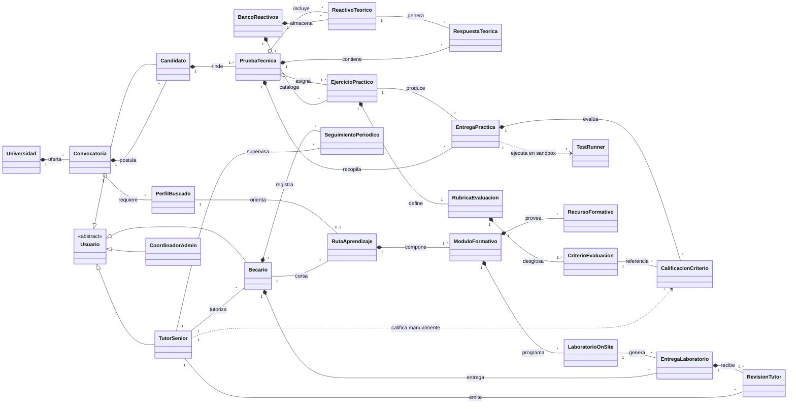

[Al inicio](/README.md) / **Modelo del dominio** / [Actores y casos de uso](/RUP/01-requisitos/01-actores-casos-uso/README.md) / [Detalle de casos de uso](/RUP/01-requisitos/03-detalle-casos-uso/README.md) / [Análisis](/RUP/02-analisis/README.md) / [Diseño](/RUP/03-diseño/README.md) / [Desarrollo](/RUP/04-desarrollo/README.md)

# Modelo del Dominio

El modelo del dominio formaliza el vocabulario, las entidades conceptuales, las relaciones estructurales y las invariantes de negocio de la plataforma **CTS Academy & Evaluator**. 

El sistema cubre dos fases interconectadas del ciclo de vida del talento técnico en el Centro Tecnológico (CTS):
1. **Admisión y Evaluación Técnica**: Convocatoria, aplicación, ejecución de pruebas teóricas/prácticas en sandbox y calificación basada en rúbricas por evaluadores senior.
2. **CTS Academy (Formación On-Site)**: Incorporación como becario, itinerario por rutas de aprendizaje personalizadas, entregas de laboratorios prácticos tipo ticket/PR y mentoría continua.

---

## Diagrama Conceptual del Dominio

<i>Código fuente: [modeloDominio.puml](modeloDominio.puml)</i>

---

## Glosario de Términos del Dominio

* **`Universidad`**: Institución de educación superior con la que CTS mantiene un convenio marco o específico para la recepción de estudiantes en prácticas curriculares o extracurriculares.
* **`Convocatoria`**: Proceso formal y temporalizado de captación y selección de candidatos para un periodo formativo determinado (ej. semestre académico o temporada de verano).
* **`PerfilBuscado`**: Especialidad técnica requerida por el centro de desarrollo (ej. *Frontend Web (Vue/React)*, *Backend API (Python/FastAPI/PHP)*, *Fullstack*, *QA & DevOps*).
* **`Candidato`**: Estudiante o egresado que se postula a una convocatoria y es sujeto del proceso de evaluación de aptitudes.
* **`PruebaTecnica`**: Instancia de evaluación generada para un candidato particular. Combina una sección teórica objetiva y una sección práctica de desarrollo de software con tiempo límite.
* **`BancoReactivos`**: Catálogo centralizado y versionado de preguntas teóricas y retos de código mantenidos por los ingenieros senior de CTS.
* **`ReactivoTeorico`**: Ítem de evaluación conceptual (HTML semántico, selectores CSS/Flexbox, asincronía en JavaScript, operaciones Git, arquitectura web, bases de datos). Puede ser de opción múltiple o respuesta corta estructurada.
* **`RespuestaTeorica`**: Registro de la respuesta suministrada por el candidato para un reactivo teórico concreto, incluyendo corrección y puntuación.
* **`EjercicioPractico`**: Desafío práctico de programación o maquetación (ej. replicar un componente UI responsivo, implementar interacción asíncrona con API Fetch o resolver una estructura de datos algorítmica). Contiene repositorio base o plantilla.
* **`RubricaEvaluacion`**: Instrumento formal de evaluación cualitativa y cuantitativa asociado a un ejercicio práctico. Establece estándares objetivos de corrección.
* **`CriterioEvaluacion`**: Dimensión evaluable dentro de una rúbrica (ej. *Semántica y Accesibilidad*, *Fidelidad al diseño y CSS limpio*, *Calidad del código JS y separación de responsabilidades*, *Buenas prácticas y uso de Git*).
* **`EntregaPractica`**: Solución de código remitida por el candidato (rama, pull request o archivo comprimido con código fuente).
* **`CalificacionCriterio`**: Asignación de puntos y notas de retroalimentación otorgadas por un evaluador senior a un criterio específico de la rúbrica.
* **`TestRunner`**: Entorno sandbox aislado (contenedor efímero sin salida a red externa) responsable de ejecutar pruebas unitarias automáticas, formateadores y análisis estático sobre el código entregado por el candidato.
* **`DictamenFinal`**: Resolución colegiada sobre la prueba técnica del candidato (`Apto Directo`, `Apto con Refuerzo`, `No Apto`).
* **`Becario`**: Candidato apto que ha formalizado su incorporación al centro de desarrollo e inicia su estancia de prácticas formativas on-site.
* **`RutaAprendizaje`**: Itinerario curricular estructurado diseñado por CTS para guiar la capacitación técnica y la adaptación a los estándares de producción de la empresa.
* **`ModuloFormativo`**: Bloque temático secuencial dentro de una ruta de aprendizaje (ej. *Arquitectura Limpia y Patrones*, *Gestión de Estado*, *Testing y CI/CD*).
* **`LaboratorioOnSite`**: Ticket o tarea técnica de dificultad progresiva que el becario debe implementar en su estación de trabajo local y someter a revisión mediante Pull Request.
* **`EntregaLaboratorio`**: Instancia de entrega de un laboratorio formativo por parte del becario, enlazada al repositorio interno de control de versiones.
* **`RevisionTutor`**: Sesión y registro de revisión de código (*Code Review*) realizada por un tutor senior, emitiendo retroalimentación formativa y dictamen de aprobación o solicitud de cambios.
* **`SeguimientoPeriodico`**: Registro periódico (semanal/quincenal) de la evolución formativa, horas dedicadas, cumplimiento de hitos y aspectos actitudinales del becario.
* **`TutorSenior`**: Desarrollador senior de CTS responsable de diseñar pruebas, evaluar candidatos técnicos y guiar a los becarios durante su estancia on-site.
* **`CoordinadorAdmin`**: Responsable institucional de CTS encargado de gestionar convocatorias, convenios con universidades y asignación de tutores.

---

## Máquinas de Estados de Entidades Clave

### 1. Ciclo de Vida de la Prueba Técnica (`PruebaTecnica`)
Una prueba técnica no puede ser reabierta una vez consumido el tiempo o enviada la entrega:

|Diagrama de Estados de Prueba Técnica|
|:-:|
||
|<i>Código fuente: [pruebaTecnica-estados.puml](estados-entidades/pruebaTecnica-estados.puml)</i>|

### 2. Ciclo de Vida de la Convocatoria (`Convocatoria`)
Controla el periodo de postulaciones y la fase de dictamen:

|Diagrama de Estados de Convocatoria|
|:-:|
||
|<i>Código fuente: [convocatoria-estados.puml](estados-entidades/convocatoria-estados.puml)</i>|

### 3. Ciclo de Vida del Laboratorio en Academy (`EntregaLaboratorio`)
Replica el flujo real de trabajo en equipo ágil de CTS mediante Pull Requests y Code Review:

|Diagrama de Estados de Entrega de Laboratorio|
|:-:|
||
|<i>Código fuente: [entregaLaboratorio-estados.puml](estados-entidades/entregaLaboratorio-estados.puml)</i>|

---

## Invariantes y Reglas del Dominio

1. **Unicidad y caducidad del Token de Prueba Técnica**:
   * Cada instancia de `PruebaTecnica` posee un `tokenAcceso` único e intransferible.
   * El token solo es válido dentro del rango de fechas de la convocatoria activa.
   * La primera invocación con dicho token inicia el cronómetro del servidor de forma irreversible.
2. **Cronometraje Inmutable en Servidor**:
   * El cómputo del tiempo límite (`tiempoLimiteMinutos`) se gestiona exclusivamente en el backend (`fechaInicio + duracion`). Ninguna manipulación del cliente frontend puede alterar o extender el tiempo límite restante.
   * Si el tiempo expira sin confirmación explícita del candidato, el sistema ejecuta la transición automática a `EXPIRADA`, congelando el último estado persistido de las respuestas.
3. **Composición de Calificaciones de Admisión**:
   * La calificación total se desglosa estrictamente en:
     $$\text{CalificacionTotal} = \text{CalificacionTeorica} + \text{CalificacionPractica}$$
   * La parte teórica es objetiva (evaluada al 100% por reglas automáticas).
   * La parte práctica combina métricas automáticas del `TestRunner` (pass/fail de tests) con la puntuación asignada por el `TutorSenior` en base a los criterios ponderados de la `RubricaEvaluacion`.
4. **Transición Estricta de Candidato a Becario**:
   * Un `Candidato` **nunca** puede convertirse directamente en `Becario` sin una `PruebaTecnica` en estado `CALIFICADA` con `dictamen in {AptoDirecto, AptoConRefuerzo}`.
   * La formalización del alta como `Becario` requiere asignación obligatoria de al menos un `TutorSenior` y una `RutaAprendizaje`.
5. **Aislamiento y Seguridad en Sandbox (`TestRunner`)**:
   * El código entregado por los candidatos se evalúa en contenedores Docker efímeros, con límites estrictos de memoria RAM (máx. 256MB), tiempo de CPU (máx. 10s) y red externa totalmente inhabilitada (`--network none`).
6. **Inmutabilidad y Preservación Histórica**:
   * Las evaluaciones, entregas de código, revisiones y notas históricas **nunca** sufren borrado físico en base de datos. Se conservan para auditoría de convocatorias y trazabilidad de convenios universitarios.
